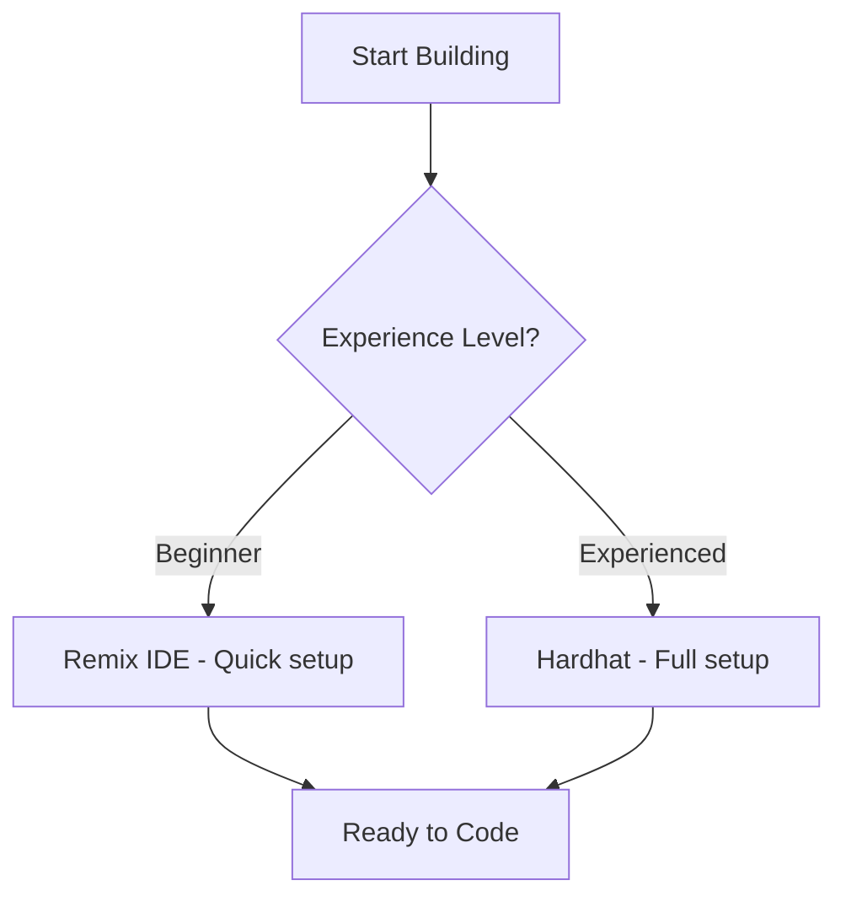

# Polkadot Hackathon Development Guide

_For Developers New to Web3_

## 1. Quick Start with kitdot

### Who This Guide Is For

Developers with solid programming skills but no Web3/Polkadot experience.

### Key Goal

Deploy working smart contracts on Polkadot testnet and build a functional frontend within hackathon timeframes.

### Start Your Project with kitdot

**Recommended**: Use kitdot for proper network configuration and project setup:

```bash
npx kitdot install -y
```

or

```bash
npm install -g kitdot
kitdot init my-polkadot-project
cd my-polkadot-project
```

**Why kitdot?** Ensures proper network settings, correct dependencies, and battle-tested configurations. Skip setup headaches and start building immediately.

**Existing Project?** Start fresh with kitdot and copy your files over. This prevents configuration conflicts and network connection issues.

## 2. Pre-Built Contract Libraries

### Leverage Existing Code

Before building from scratch, explore these battle-tested contract libraries:

**Thirdweb Contracts**

- **Repository:** [thirdweb-dev/contracts](https://github.com/thirdweb-dev/contracts/tree/main/contracts)
- **Best for:** NFTs, tokens, marketplaces, governance
- **Advantage:** Production-ready, gas-optimized implementations
- **Note:** May need size optimization for Polkadot's 100KB limit

**OpenZeppelin Contracts**

- **Repository:** [OpenZeppelin/openzeppelin-contracts](https://github.com/OpenZeppelin/openzeppelin-contracts)
- **Best for:** Standard implementations (ERC20, ERC721, ERC1155)
- **Advantage:** Industry standard, well-audited
- **Note:** Often too heavy for Polkadot - use as reference for minimal implementations

**Polkadot-Optimized Alternative**

- **Repository:** [papermoonio/openzeppelin-contracts-polkadot](https://github.com/papermoonio/openzeppelin-contracts-polkadot)
- **Best for:** Size-optimized versions for Polkadot
- **Advantage:** Already adapted for 100KB constraint

### Strategy

1. **Browse** existing contracts for inspiration
2. **Copy** core logic patterns
3. **Simplify** by removing unnecessary features
4. **Test** contract size with `npx hardhat compile`

## 3. Development Environment Setup

### Choose Your Path



| Factor                | Remix IDE        | Hardhat            |
| --------------------- | ---------------- | ------------------ |
| **Setup Time**        | Quick            | Moderate           |
| **Experience Needed** | None             | JavaScript/Node.js |
| **Best For**          | Simple contracts | Complex dApps      |

### Path 1: Remix IDE

1. Open [Polkadot Remix IDE](https://remix.polkadot.io)
2. Get testnet tokens from [faucet](https://faucet.polkadot.io/?parachain=1111)
3. Start coding in browser

### Path 2: Manual Hardhat Setup (Not Recommended)

**Use kitdot instead** for automated setup, but if you must set up manually:

```bash
# Better: Use kitdot init instead
mkdir hackathon-project && cd hackathon-project
npm init -y
npm install --save-dev @parity/hardhat-polkadot solc@0.8.28
npm install --force @nomicfoundation/hardhat-toolbox
npx hardhat-polkadot init
```

**kitdot handles this automatically** with proper network configurations.

**Create hardhat.config.js:**

```javascript
require("@nomicfoundation/hardhat-toolbox");
require("@parity/hardhat-polkadot");
const { vars } = require("hardhat/config");

module.exports = {
  solidity: "0.8.28",
  resolc: { version: "0.3.0", compilerSource: "npm" },
  networks: {
    passetHub: {
      polkavm: true,
      url: "https://testnet-passet-hub-eth-rpc.polkadot.io",
      accounts: [vars.get("PRIVATE_KEY")],
    },
  },
};
```

**Setup Wallet:**

```bash
npx hardhat vars set PRIVATE_KEY
# Enter your private key (no 0x prefix)
```

**Test Setup:**

```bash
npx hardhat compile
npx hardhat ignition deploy ./ignition/modules/Test.js --network passetHub
```

## 4. Smart Contract Development

### Critical Constraints

- **Maximum bytecode:** ~100KB
- **Solidity version:** ^0.8.28

### Test Contract

```solidity
// SPDX-License-Identifier: MIT
pragma solidity ^0.8.28;

contract Test {
    uint256 public value = 42;
    function setValue(uint256 _value) external { value = _value; }
}
```

### Minimal ERC20

```solidity
contract SimpleToken {
    mapping(address => uint256) public balanceOf;
    uint256 public totalSupply;
    string public name;
    string public symbol;

    constructor(string memory _name, string memory _symbol, uint256 _supply) {
        name = _name; symbol = _symbol; totalSupply = _supply;
        balanceOf[msg.sender] = _supply;
    }

    function transfer(address to, uint256 amount) external returns (bool) {
        require(balanceOf[msg.sender] >= amount, "Insufficient balance");
        balanceOf[msg.sender] -= amount;
        balanceOf[to] += amount;
        return true;
    }
}
```

### Deployment Strategy

```javascript
// ignition/modules/YourModule.js
const { buildModule } = require("@nomicfoundation/hardhat-ignition/modules");

module.exports = buildModule("YourModule", (m) => {
  const contract = m.contract("YourContract", []);
  return { contract };
});
```

```bash
npx hardhat compile
npx hardhat ignition deploy ./ignition/modules/YourModule.js --network passetHub
```

## 5. Frontend Integration

### Connect to Polkadot Network

```javascript
const paseoConfig = {
  chainId: "0x1911f0a6", // 420420422
  chainName: "Polkadot Hub TestNet",
  nativeCurrency: { name: "PAS", symbol: "PAS", decimals: 18 },
  rpcUrls: ["https://testnet-passet-hub-eth-rpc.polkadot.io"],
  blockExplorerUrls: ["https://blockscout-passet-hub.parity-testnet.parity.io"],
};

await window.ethereum.request({
  method: "wallet_addEthereumChain",
  params: [paseoConfig],
});
```

### Contract Interaction (Ethers.js)

```javascript
import { ethers } from "ethers";

const provider = new ethers.JsonRpcProvider(
  "https://testnet-passet-hub-eth-rpc.polkadot.io"
);
const contract = new ethers.Contract(contractAddress, abi, signer);
const result = await contract.someFunction();
```

### Template Projects

- **kitdot (Recommended):** `kitdot init -y` - Configured templates with proper network settings
- **React + Hardhat:** [create-polkadot-dapp](https://www.npmjs.com/package/create-polkadot-dapp)
- **Examples:** [hardhat-polkadot-example](https://github.com/UtkarshBhardwaj007/hardhat-polkadot-example)

## 6. Troubleshooting

### Emergency Commands

```bash
# Clean restart
npx hardhat clean && rm -rf ignition/deployments/ && npx hardhat compile

# Check balance
npx hardhat console --network passetHub
> await ethers.provider.getBalance("YOUR_ADDRESS")

# Track deployment
npx hardhat ignition track-tx <txHash> <deploymentId> --network passetHub
```

## 7. Project Ideas

**Proven Simple Ideas:**

- **Custom Token:** [ERC-20 Tutorial](https://docs.polkadot.com/tutorials/smart-contracts/deploy-erc20/)
- **NFT Collection:** [NFT Tutorial](https://docs.polkadot.com/tutorials/smart-contracts/deploy-nft/)
- **Simple DeFi:** [Uniswap V2 Example](https://github.com/papermoonio/uniswap-v2-polkadot)

## 8. Network Details

- **Chain ID:** 420420422
- **RPC:** https://testnet-passet-hub-eth-rpc.polkadot.io
- **Explorer:** https://blockscout-passet-hub.parity-testnet.parity.io
- **Faucet:** https://faucet.polkadot.io/?parachain=1111

## 9. Security Best Practices

- Keep contracts under 100KB
- Validate all inputs
- Use minimal implementations instead of heavy libraries

### Simple Reentrancy Guard

```solidity
contract SimpleReentrancyGuard {
    bool private locked;
    modifier nonReentrant() {
        require(!locked, "Reentrant call");
        locked = true; _; locked = false;
    }
}
```

## 10. Demo Preparation

**Essential Components:**

1. Deployed contract on block explorer
2. Frontend connecting to wallet
3. Core functionality working
4. Clear value demonstration

**Demo Script:**

- Brief: Problem statement
- Core: Live demo of solution
- Wrap: Technical highlights & future vision

## 11. Resources & Tools

**Development Environments:**

- [Remix IDE](https://docs.polkadot.com/develop/smart-contracts/dev-environments/remix/)
- [Hardhat Guide](https://docs.polkadot.com/develop/smart-contracts/dev-environments/hardhat/)

**Libraries:**

- [Ethers.js Integration](https://docs.polkadot.com/develop/smart-contracts/libraries/ethers-js/)
- [Web3.js Integration](https://docs.polkadot.com/develop/smart-contracts/libraries/web3-js/)

**Detailed References:**

- **LLM Development Guide:** Use `llms-writing-guidelines.md` when creating documentation
- **Complete Setup:** `docs/seed-content/llms_checklist.md`
- **Network Details:** `docs/seed-content/configs.md`
- **Tools Overview:** `docs/polkadot-development-tools.md`

**Video Tutorials:**

- [Deploy Contracts Workshop](https://youtu.be/TGgpG1jPxeE)
- [Smart Contracts on Polkadot](https://www.youtube.com/watch?v=GPuTt10dxKI)

## Start with kitdot

Use `kitdot init -y` for proper project setup with verified network configurations. Alternative templates available.

You're building on Polkadot using familiar Ethereum tools. Focus on working functionality over perfect code.
