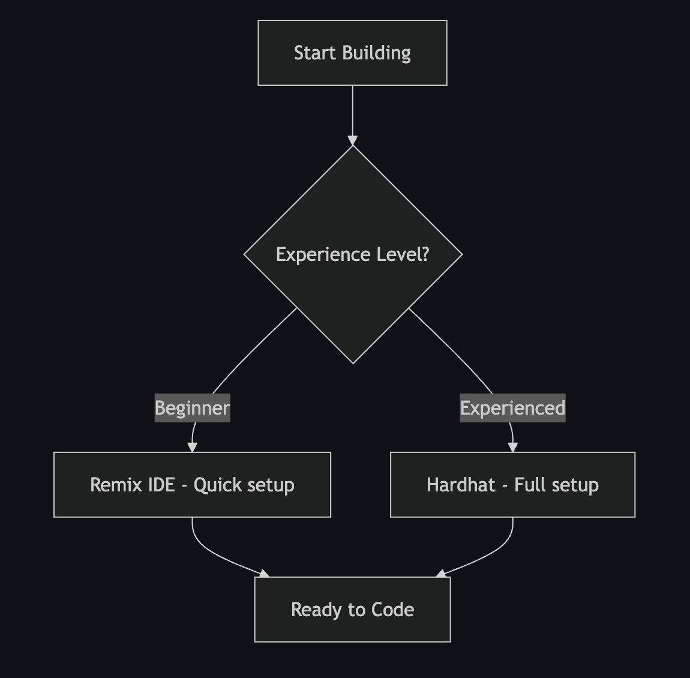

# Guia de Desenvolvimento para Hackathons Polkadot

_Para Desenvolvedores Novos na Web3_

## Visão Geral da Documentação

- **[Ferramentas de Desenvolvimento Polkadot](polkadot-development-tools.md)** - Kit abrangente de ferramentas e mapa de recursos para construir no Polkadot
- **[Smart Contracts 101](101-smart-contracts-polkadot.md)** - Guia completo para iniciantes sobre smart contracts Polkadot
- **[Writing Guidelines](writing-guidelines.md)** - Padrões de escrita e melhores práticas para agentes de IA
- **[Agents](Agents.md)** - Guia completo de implantação e referência de solução de problemas para agentes

## 1. Início Rápido com Kitdot

### Para Quem é Este Guia

Desenvolvedores com habilidades sólidas de programação, mas sem experiência em Web3/Polkadot.

### Objetivo Principal

Implementar contratos inteligentes funcionais na testnet do Polkadot e construir um frontend funcional dentro dos prazos do hackathon.

### Inicie Seu Projeto com Kitdot

**Recomendado**: Use kitdot@latest para configuração adequada da rede e setup do projeto:

```bash
npx kitdot@latest install -y
```

ou

```bash
npm install -g kitdot@latest
kitdot init my-polkadot-project
cd my-polkadot-project
```

**Por que kitdot?** Garante configurações adequadas da rede, dependências corretas e configurações testadas em batalha. Pule as dores de cabeça de configuração e comece a desenvolver imediatamente.

**Experiência Web2 na Web3:** A configuração padrão do kitdot inicializa um projeto frontend completo que oferece uma experiência de usuário Web2 familiar para aplicações Web3. Os usuários interagem com sua dApp sem precisar entender a complexidade do blockchain.

**Projeto Existente?** Comece do zero com kitdot@latest e copie seus arquivos. Isso previne conflitos de configuração e problemas de conexão de rede.

## 2. Bibliotecas de Contratos Pré-Construídas

### Aproveite Código Existente

Antes de construir do zero, explore essas bibliotecas de contratos testadas em batalha:

**Contratos Thirdweb**

- **Repositório:** [thirdweb-dev/contracts](https://github.com/thirdweb-dev/contracts/tree/main/contracts)
- **Melhor para:** NFTs, tokens, marketplaces, governança
- **Vantagem:** Implementações prontas para produção, otimizadas para gas
- **Nota:** Pode precisar de otimização de tamanho para o limite de 100KB do Polkadot

**Contratos OpenZeppelin Otimizados para Polkadot**

- **Repositório:** [papermoonio/openzeppelin-contracts-polkadot](https://github.com/papermoonio/openzeppelin-contracts-polkadot)
- **Melhor para:** Implementações padrão (ERC20, ERC721, ERC1155)

### Estratégia

1. **Navegue** pelos contratos existentes para inspiração
2. **Copie** padrões de lógica central
3. **Simplifique** removendo recursos desnecessários
4. **Teste** o tamanho do contrato com `npx hardhat compile`

## 3. Configuração do Ambiente de Desenvolvimento

### Escolha Seu Caminho



| Fator                     | Remix IDE        | Hardhat            |
| ------------------------- | ---------------- | ------------------ |
| **Tempo de Setup**       | Rápido           | Moderado           |
| **Experiência Necessária** | Nenhuma         | JavaScript/Node.js |
| **Melhor Para**           | Contratos simples | dApps complexos    |

### Caminho 1: Remix IDE

1. Abra o [Polkadot Remix IDE](https://remix.polkadot.io)
2. Obtenha tokens de testnet do [faucet](https://faucet.polkadot.io/?parachain=1111)
3. Comece a codificar no navegador

**Obtendo ABI para Projetos Frontend:**
Após compilar contratos no Remix:

1. Vá para a aba **Solidity Compiler**
2. Clique no nome do seu contrato sob artefatos de compilação
3. Copie o array **ABI** dos detalhes de compilação
4. Use em projetos frontend:

```javascript
// Salve ABI como contractABI.json ou importe diretamente
import { ethers } from "ethers";

const contractABI = [
  /* cole o array ABI aqui */
];
const contract = new ethers.Contract(contractAddress, contractABI, signer);
```

### Caminho 2: Setup Manual do Hardhat (Não Recomendado)

**Use kitdot@latest em vez disso** para setup automatizado, mas se você precisar configurar manualmente:

```bash
# Melhor: Use kitdot@latest init em vez disso
mkdir hackathon-project && cd hackathon-project
npm init -y
npm install --save-dev @parity/hardhat-polkadot solc@0.8.28
npm install --force @nomicfoundation/hardhat-toolbox
npx hardhat-polkadot init
```

**IMPORTANTE:** Sempre use `@parity/hardhat-polkadot` em vez do hardhat padrão. Este plugin fornece compatibilidade essencial com PolkaVM e configurações de rede necessárias para implantação no Polkadot.

**kitdot@latest cuida disso automaticamente** com configurações adequadas da rede.

### Caminho 3: Rede de Desenvolvimento Local

Para testes locais sem conectar a testnets:

```bash
# Execute testnet genérica local (NÃO é uma testnet PolkaVM)
npx hardhat node

# Em outro terminal, implante na rede local
npx hardhat ignition deploy ./ignition/modules/YourModule.js --network localhost
```

**Nota:** Isso executa uma testnet Ethereum padrão local, não uma rede compatível com PolkaVM. Use para desenvolvimento inicial e testes antes de implantar no Paseo.

**Criar hardhat.config.js:**

```javascript
require("@nomicfoundation/hardhat-toolbox");
require("@parity/hardhat-polkadot");
const { vars } = require("hardhat/config");

module.exports = {
  solidity: "0.8.28",
  resolc: { version: "0.3.0", compilerSource: "npm" },
  networks: {
    passetHub: {
      polkavm: true,
      url: "https://testnet-passet-hub-eth-rpc.polkadot.io",
      accounts: [vars.get("PRIVATE_KEY")],
    },
  },
};
```

**Configurar Carteira:**

```bash
npx hardhat vars set PRIVATE_KEY
# Digite sua chave privada (sem prefixo 0x)
```

**Testar Setup:**

```bash
npx hardhat compile
npx hardhat ignition deploy ./ignition/modules/Test.js --network passetHub
```

## 4. Desenvolvimento de Contratos Inteligentes

### Restrições Críticas

- **Bytecode máximo:** ~100KB
- **Versão do Solidity:** ^0.8.28

### Contrato de Teste

```solidity
// SPDX-License-Identifier: MIT
pragma solidity ^0.8.28;

contract Test {
    uint256 public value = 42;
    function setValue(uint256 _value) external { value = _value; }
}
```

### ERC20 Mínimo

```solidity
contract SimpleToken {
    mapping(address => uint256) public balanceOf;
    uint256 public totalSupply;
    string public name;
    string public symbol;

    constructor(string memory _name, string memory _symbol, uint256 _supply) {
        name = _name; symbol = _symbol; totalSupply = _supply;
        balanceOf[msg.sender] = _supply;
    }

    function transfer(address to, uint256 amount) external returns (bool) {
        require(balanceOf[msg.sender] >= amount, "Insufficient balance");
        balanceOf[msg.sender] -= amount;
        balanceOf[to] += amount;
        return true;
    }
}
```

### Estratégia de Deploy

```javascript
// ignition/modules/YourModule.js
const { buildModule } = require("@nomicfoundation/hardhat-ignition/modules");

module.exports = buildModule("YourModule", (m) => {
  const contract = m.contract("YourContract", []);
  return { contract };
});
```

```bash
npx hardhat compile
npx hardhat ignition deploy ./ignition/modules/YourModule.js --network passetHub
```

## 5. Configuração da Carteira (Se não estiver usando o template padrão do kitdot)

### Habilitar Testnets na sua Carteira

**MetaMask:**

1. Abra a extensão MetaMask
2. Clique no ícone do seu perfil (canto superior direito)
3. Vá para **Settings** → **Advanced**
4. Habilite **Show test networks**
5. Seu dropdown de rede agora mostrará opções de testnet

**Talisman:**

1. Abra a extensão Talisman
2. Vá para **Settings** → **Networks & Tokens**
3. Habilite **Show test networks**
4. Redes de testnet aparecerão na sua lista de redes

### Adicionar Rede Paseo ao MetaMask

**Método Rápido (Recomendado):**

1. Visite [https://chainlist.org/?search=passet](https://chainlist.org/?search=passet)
2. Encontre "Polkadot Asset Hub Testnet"
3. Clique em **Connect Wallet** e **Add to MetaMask**
4. Aprove a adição da rede no MetaMask

**Método Manual:**

```javascript
// Adicione esta configuração manualmente no MetaMask
Network Name: Polkadot Hub TestNet
Chain ID: 420420422
RPC URL: https://testnet-passet-hub-eth-rpc.polkadot.io
Currency Symbol: PAS
Block Explorer: https://blockscout-passet-hub.parity-testnet.parity.io
```

## 6. Integração Frontend

### Conectar à Rede Polkadot

```javascript
const paseoConfig = {
  chainId: "0x1911f0a6", // 420420422
  chainName: "Polkadot Hub TestNet",
  nativeCurrency: { name: "PAS", symbol: "PAS", decimals: 18 },
  rpcUrls: ["https://testnet-passet-hub-eth-rpc.polkadot.io"],
  blockExplorerUrls: ["https://blockscout-passet-hub.parity-testnet.parity.io"],
};

await window.ethereum.request({
  method: "wallet_addEthereumChain",
  params: [paseoConfig],
});
```

### Interação com Contratos (Ethers.js)

```javascript
import { ethers } from "ethers";

const provider = new ethers.JsonRpcProvider(
  "https://testnet-passet-hub-eth-rpc.polkadot.io"
);
const contract = new ethers.Contract(contractAddress, abi, signer);
const result = await contract.someFunction();
```

### Projetos Template

- **kitdot@latest (Recomendado):** `kitdot@latest init -y` - Templates configurados com configurações adequadas da rede
- **React + Hardhat:** [create-polkadot-dapp](https://www.npmjs.com/package/create-polkadot-dapp)
- **Exemplos:** [hardhat-polkadot-example](https://github.com/UtkarshBhardwaj007/hardhat-polkadot-example)

### Template de Gestão de Projetos

Para gestão eficaz de projetos de hackathon e colaboração em equipe:

- **Template GitHub Projects:** [Quadro de Projeto Hackathon](https://github.com/orgs/w3b3d3v/projects/34/views/1) - Quadro de projeto pronto para uso com rastreamento de tarefas, planejamento de sprints e recursos de coordenação de equipe

## 6. Resolução de Problemas

### Comandos de Emergência

```bash
# Reinício limpo
npx hardhat clean && rm -rf ignition/deployments/ && npx hardhat compile

# Verificar saldo
npx hardhat console --network passetHub
> await ethers.provider.getBalance("YOUR_ADDRESS")

# Rastrear deploy
npx hardhat ignition track-tx <txHash> <deploymentId> --network passetHub
```

## 7. Ideias de Projetos

**Ideias Simples Comprovadas:**

- **Token Personalizado:** [Tutorial ERC-20](https://docs.polkadot.com/tutorials/smart-contracts/deploy-erc20/)
- **Coleção NFT:** [Tutorial NFT](https://docs.polkadot.com/tutorials/smart-contracts/deploy-nft/)
- **DeFi Simples:** [Exemplo Uniswap V2](https://github.com/papermoonio/uniswap-v2-polkadot)

**Ideias Abrangentes de Economia de Compartilhamento P2P:**

- **[Catálogo Abrangente de Economia de Compartilhamento P2P](https://docs.google.com/document/d/165krMbAVbejDAOTD2xa9CB1hDcmciHXI0LJ4hEpH2SQ):** Catálogo extenso de plataformas de economia de compartilhamento peer-to-peer em vários setores com aplicações implementadas e "Ideias Possíveis" para categorias inexploradas. Perfeito para identificar lacunas de mercado e construir alternativas descentralizadas.

## 8. Detalhes da Rede

- **Chain ID:** 420420422
- **RPC:** https://testnet-passet-hub-eth-rpc.polkadot.io
- **Explorer:** https://blockscout-passet-hub.parity-testnet.parity.io
- **Faucet:** https://faucet.polkadot.io/?parachain=1111

## 9. Melhores Práticas de Segurança

- Mantenha contratos abaixo de 100KB
- Valide todas as entradas
- Use implementações mínimas em vez de bibliotecas pesadas

### Proteção Simples Contra Reentrância

```solidity
contract SimpleReentrancyGuard {
    bool private locked;
    modifier nonReentrant() {
        require(!locked, "Reentrant call");
        locked = true; _; locked = false;
    }
}
```

## 10. Preparação para Demo

**Componentes Essenciais:**

1. Contrato implementado no block explorer
2. Frontend conectando à carteira
3. Funcionalidade principal funcionando
4. Demonstração clara de valor

**Script da Demo:**

- Breve: Declaração do problema
- Central: Demo ao vivo da solução
- Conclusão: Destaques técnicos e visão futura

## 11. Recursos e Ferramentas

**Documentação Essencial**

- [Mapa de Ferramentas Open Source Polkadot](polkadot-development-tools.md): Criamos um mapa de todas as principais ferramentas open source no Polkadot.
- [Guia Básico de Contratos Inteligentes Polkadot](101-smart-contracts-polkadot.md): Se você quiser começar do zero e precisar de documentação mais aprofundada sobre contratos inteligentes Polkadot, como um 101 para iniciantes, sugerimos conferir este guia.

**Ambientes de Desenvolvimento:**

- [Remix IDE](https://docs.polkadot.com/develop/smart-contracts/dev-environments/remix/)
- [Guia Hardhat](https://docs.polkadot.com/develop/smart-contracts/dev-environments/hardhat/)

**Bibliotecas:**

- [Integração Ethers.js](https://docs.polkadot.com/develop/smart-contracts/libraries/ethers-js/)
- [Integração Web3.js](https://docs.polkadot.com/develop/smart-contracts/libraries/web3-js/)

**Referências Detalhadas:**

- **Diretrizes de Escrita:** Use `writing-guidelines.md` ao criar documentação
- **Setup de Contexto Agentes:** `Agents.md`
- **Detalhes da Rede:** `docs/seed-content/configs.md`
- **Visão Geral de Ferramentas:** `docs/polkadot-development-tools.md`

**Tutoriais em Vídeo:**

- [Workshop de Deploy de Contratos](https://youtu.be/TGgpG1jPxeE)
- [Contratos Inteligentes no Polkadot](https://www.youtube.com/watch?v=GPuTt10dxKI)

## Comece com Kitdot

Use `kitdot@latest init -y` para setup adequado do projeto com configurações de rede verificadas. Templates alternativos disponíveis.

Você está desenvolvendo no Polkadot usando ferramentas familiares do Ethereum. Foque em funcionalidade que funciona em vez de código perfeito.